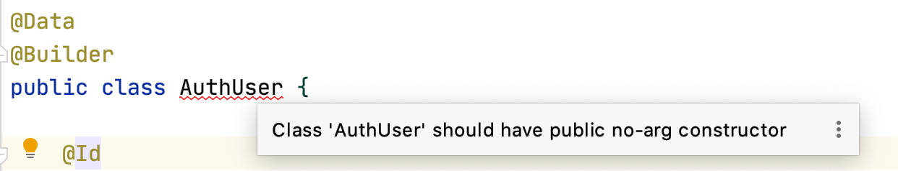
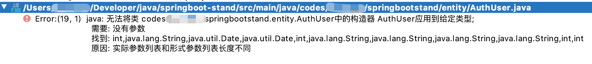
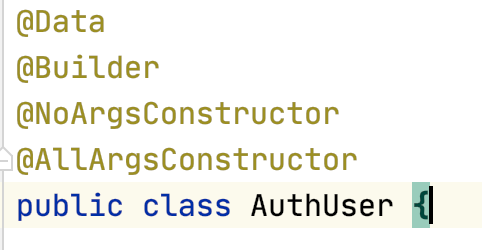
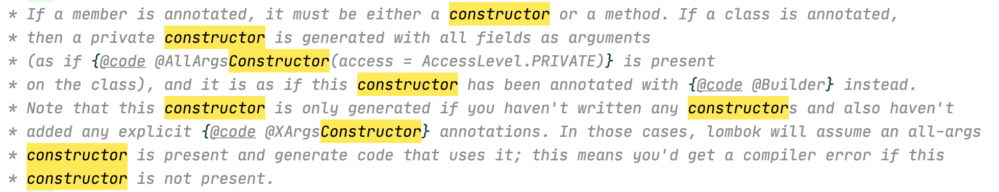

Lombok 是 Java 开发的一件利器，它可以减少大量模板代码的使用。在其中最常使用到的注解应该就是 `@Data` ，可以在编译时自动生成 `getter`、`setter`、
`equals`、`hashcode` 等方法。而 `@Builder` 则用来快速实现 builder 模式。但是，如果两者同时使用却会产生一些意想不到的报错。

<!--more-->
---

如果单纯在 class 上添加这两个注解，IDE 会提示缺少无参构造器。

在此基础上添加 `@NoArgsConstructor` 注解后则会直接报错。

然后你会在使用谷歌或者百度之后学会再加一个 `@AllArgsConstructor` 注解，发现问题解决了。

## 首先，为什么在 `@Data` 的基础上添加 `@Builder` 会出现缺少无参构造器的问题  

这个其实比较好理解。无参构造器就是 class 的默认构造器，如果你没有显式声明它，那么在编译时，编译器发现你没有显式声明的构造器，就会自动生成一个无参构造器。

而添加了 `@Builder` 后，Lombok 为我们添加了一个全参构造器，编译器找到了显式声明的构造器，却没有显式声明的无参构造器，则会编译失败。

## 然后，添加无参构造器后方法参数问题

手动声明无参构造器之后，`@Builder` 注解会调用另一段逻辑：

简单来说，如果源码中没有声明构造器，则自动生成全参构造器；若你已经声明了一个构造器，那么它就放弃生成。

但是 builder 模式的最后一个动作，`build`，还是默认调用全参的构造器来生成对象。这才造成了 `期望是个无参构造器，获得的参数列表却不一样` 的报错。

## 总结

当你希望同时使用 `@Data` 和 `@Builder` 注解时，记住需要自己显式声明 `无参构造器` 和 `全参构造器`。这可以通过添加 `@NoArgsConstructor` 和 `@AllArgsConstructor` 注解实现。

当然，你也可以不用注解，自己写代码。IDEA 可以快速创建构造器。
