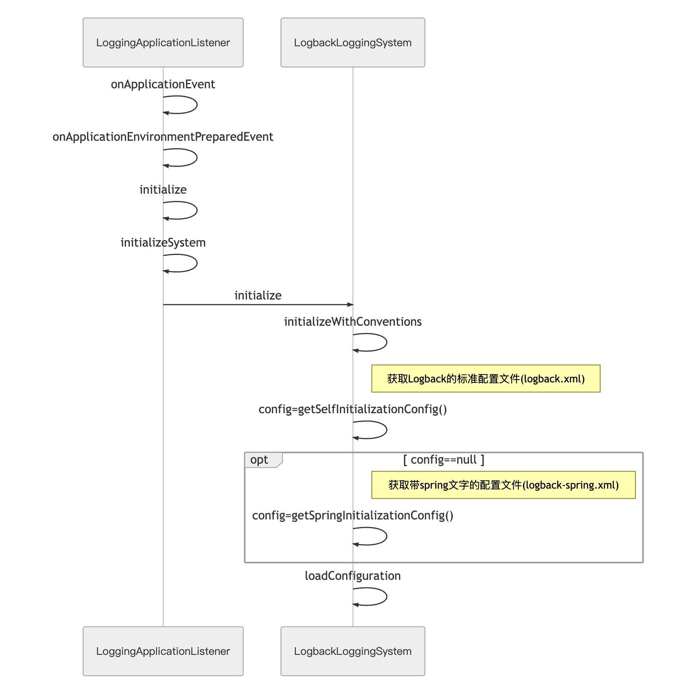
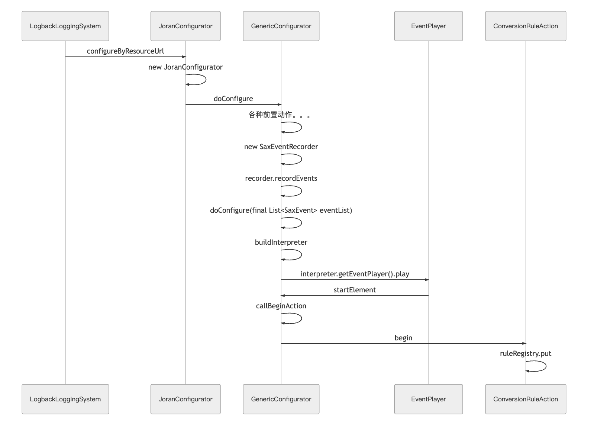
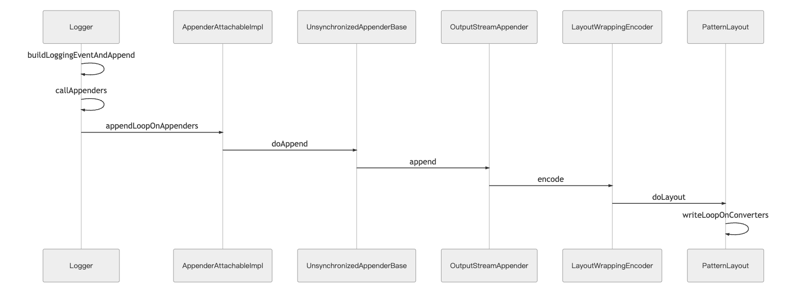

## 如何自动对对象进行 json 序列化
### 前情提要
java 开发中，大家一般都会用 Slf4j+logback 的组合来写日志。我也是。

logback 有个很方便的功能：当你占位符对应的参数是个对象的时候，它会自动调用该对象的 toString 方法进行序列化，不用你手动做调用。

这个已经挺方便了，但是这样子的数据展示方式还是有局限性。当你需要把一段数据拿出来给其他语言的后端、前端，甚至是业务和运营看的时候，一段 raw 的数据，对方很可能就拒绝了。

这个时候我就想到，json 是一种更通用的数据格式啊。java 里本身就有很多方便快捷的 json 框架直接使用，而且就算你拿出来的还是一行数据，现在网上有那么多 json 美化工具，查看的门槛其实很低的。

### 方案设计
确定了需要转换的格式之后，就是确定实现细节了。刚开始其实我想的是写个切面，但是很快就意识到这样并不优雅。

为了操作到所有的日志，你肯定需要把切点织入 logback 的相关方法。简单来说，就是 `ch.qos.logback.classic.Logger` 这个类的方法中。那么多方法重载，看着都心累。。。

当然，用切面肯定能实现自动 json 序列化，但是我想做的其实是「替换掉日志输出中的序列化一环」，而不是「在写日志前加一个统一操作」。两者的含义并不一样，前者是对日志框架的修改，后者是对项目本身的修改。

所幸，后来被我找到了 logback 本身的 hook-转换器，可以在内部进行 json 方法的调用。

### 具体实现
网上找到一篇自定义 MessageConverter 的文章：[自定义一个 logback 的 MessageConverter](https://www.hollischuang.com/archives/3689)。

原文用的是 fastjson。虽然公司大量用的都是这个 json 框架，但我自己的项目为了减少依赖，会直接使用 `spring-boot-starter-web` 里的 jackson。下面贴出我的修改版：

1. 自定义一个 converter：
```java
public class JsonConverter extends MessageConverter {

    private final static ObjectMapper OBJECT_MAPPER = new ObjectMapper();

    @Override
    public String convert(ILoggingEvent event) {

        try {
            List<Object> list = new ArrayList<>();
            for (Object argument : event.getArgumentArray()) {
                Object o = (argument.getClass().getClassLoader() != null || argument instanceof Collection
                    || argument instanceof Map) ? OBJECT_MAPPER.writeValueAsString(argument) : argument;
                list.add(o);
            }
            return MessageFormatter.arrayFormat(event.getMessage(), list.toArray()).getMessage();
        } catch (Exception e) {
            return super.convert(event);
        }
    }

}
```

2. 添加自定义 converter 到 logback-spring.xml 配置文件中
```xml
<configuration>
  <conversionRule conversionWord="msg" converterClass="xxx.xxx.xxx.config.JsonConverter"/>
</configuration>
```
## logback 转换器原理分析
虽然这样可以自动序列化了，但我还是有不少疑问：

MessageConverter 已经是一个具体的类了，为什么要继承它而不是它的父类 ClassicConverter 呢？为什么只要在配置文件里添加 conversionRule 就能被 logback 使用呢？如果对一个关键字添加了多个转换器，它们是怎么被调用的呢？

这些答案，都只能靠看源码了。
### springboot 加载 logback 配置文件

springboot 是使用 LoggingApplicationListener 这个类完成对日志系统初始化的。我们先来看下这个类，顺便还能理解怎么自动装配的 logback-spring.xml 文件。

当然，先放张时序图便于理解：


首先，`LoggingApplicationListerner`使用观察者模式监听到 spring 应用启动后的环境准备事件：`ApplicationEnvironmentPreparedEvent`，然后就会去执行相关的初始化操作，获取配置文件。

获取配置文件的步骤就是 spring 的特殊化处理。它会先在`getSelfInitializationConfig`查找 logback 的标准配置文件："logback-test.groovy", "logback-test.xml", "logback.groovy", “logback.xml"。如果这些文件都没有找到，spring 会去做一个文件名的修改，再去获取：

```java
/**
 * Return the spring config locations for this system. By default this method returns
 * a set of locations based on {@link #getStandardConfigLocations()}.
 * @return the spring config locations
 * @see #getSpringInitializationConfig()
 */
protected String[] getSpringConfigLocations() {
    String[] locations = getStandardConfigLocations();
    for (int i = 0; i < locations.length; i++) {
        String extension = StringUtils.getFilenameExtension(locations[i]);
        locations[i] = locations[i].substring(0, locations[i].length() - extension.length() - 1) + "-spring."
            + extension;
    }
    return locations;
}
```

它会把字符串拆成两部分，`.`前的部分，和`.`后的部分（extension），然后在两者之间加上`-spring.`组成新的字符串。logback.xml -> logback-spring.xml。

这就是为什么说没有 logback.xml 文件的时候 spring 会自动去找 logback-spring.xml 文件的原因，也是为什么存在了 logback.xml 后 logback-spring.xml 配置就会失效。

### logback 完成配置初始化

`loadConfiguration`方法会在完成前置动作后，把相关信息交还给 logback，logback 会使用 `JoranConfigurator` 进行配置初始化。

来，再来个时序图(只会提供转换器相关初始化的过程，其他元素的动作被省略了）：


细节上，SaxEventRecorder 在进行 `recordEvents ` 时会创建一个 `SAXParser` 用于解析 xml 文件，然后再调用重载的 `startElement` 方法把相关的 startElement 放到一个 list 中。

startElement 方法中，先过滤出相关 tag 的 action，然后调用 callBeginAction 依次执行具体 action 的 begin 方法。在我们这儿，就是 ConversionRuleAction。

在 ConversionRuleAction 中，会提取 conversionWord 和 conversionClass，然后把这两个字段作为一对 KV，插入一个叫 ruleResigtry 的 hashMap 中。而 ruleResigtry 本身，则会被保存在 logback 全局的 context 中。

再加之后的一些验证、上下文信息补全的操作，logback 就把一个配置文件的内容反序列化到上下文中了。


这里也能看出一个结论，当你对同一个 conversionWord 提供了多个不同的转换器的时候，只有最后一个会生效。因为依次对 conversionRule 执行ConversionRuleAction#begin，新的一个转换器会覆盖掉 ruleRegistry 中相同 key 的值。（hashMap#put 的基本知识）


### Logger 的具体调用

最后在实际使用上的流程：


而 PatternLayout 继承的 PatternLayoutBase 会在自身初始化的时候，解析配置文件中的正则表达式，然后将关键字对应的转换器添加到一条链表中。所以在执行 writeLoopOnConverters 的时候，就是依次执行这些转换器，最后吐出一条转换完的字符串。**（具体初始化的调用在哪还没看到，之后看完了再重新写一篇吧）**

## 总结

如果你只是需要添加 json 序列化的话，不用继承 MessageConverter，直接继承 ClassicConverter 然后提供相关的自定义配置就可以了。当然别忘了再配置文件里加上 conversionRule。

```java
public class JsonConverter extends ClassicConverter {

    private final static ObjectMapper OBJECT_MAPPER = new ObjectMapper();

    @Override
    public String convert(ILoggingEvent event) {

        try {
            List<Object> list = new ArrayList<>();
            for (Object argument : event.getArgumentArray()) {
                Object o = (argument.getClass().getClassLoader() != null || argument instanceof Collection
                    || argument instanceof Map) ? OBJECT_MAPPER.writeValueAsString(argument) : argument;
                list.add(o);
            }
            return MessageFormatter.arrayFormat(event.getMessage(), list.toArray()).getMessage();
        } catch (Exception e) {
            return event.getFormattedMessage();
        }
    }

}
```


